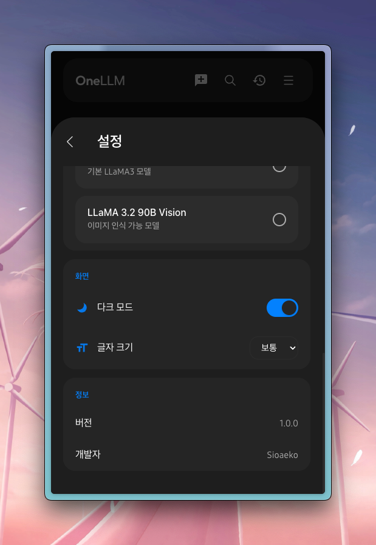
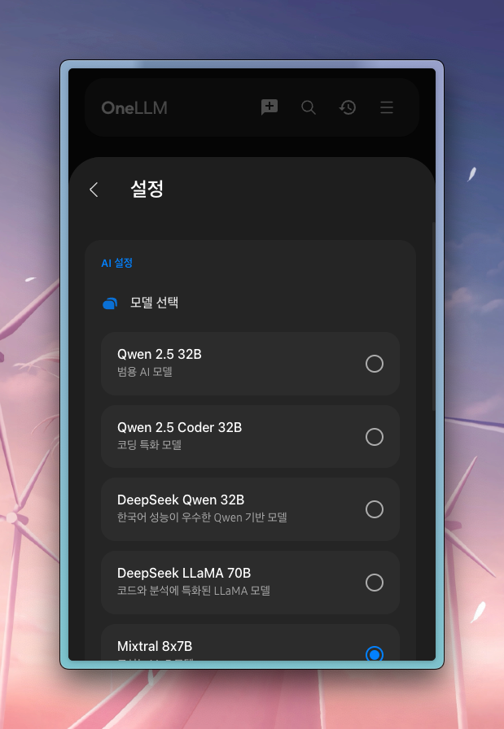

<div align="center">
  
  
  # OneLLM
  
  ### 모든 AI 언어 모델을 하나의 인터페이스로
  
  <p align="center">
    
    
    
  </p>
</div>

## 소개

OneLLM은 삼성 OneUI의 디자인 철학을 바탕으로 만들어진 AI 챗봇 인터페이스입니다. 다양한 AI 언어 모델들을 하나의 통합된 환경에서 사용할 수 있습니다.

### 주요 기능

- OneUI 디자인 시스템 적용
- 다양한 LLM 모델 지원
- 라이트/다크 모드
- 반응형 디자인
- 빠른 응답 속도

## 시작하기

### 필수 요구사항

- Node.js 18.0.0 이상
- npm 9.0.0 이상
- LLM API 키 (선택사항)

### 로컬에서 실행하기

```bash
# 저장소 클론
git clone https://github.com/sioaeko/OneLLM.git

# 프로젝트 폴더로 이동
cd OneLLM

# 의존성 설치
npm install

# 개발 서버 실행
npm run dev
```

이제 브라우저에서 `http://localhost:3000`으로 접속하여 OneLLM을 사용할 수 있습니다.

## 📸 스크린샷

<div align="center">
  <p><strong>🌙 다크 모드</strong></p>
  
  
  <br/><br/>
  
  <p><strong>☀️ 라이트 모드</strong></p>
  
  
  <br/><br/>
  
  <p><strong>💬 대화 인터페이스</strong></p>
  
</div>

## 환경 설정

1. `.env.example` 파일을 `.env`로 복사합니다.
2. `.env` 파일에서 필요한 API 키를 설정합니다.

```env
REACT_APP_OPENAI_API_KEY=your_api_key_here
REACT_APP_GROQ_API_KEY=your_api_key_here
```

## OneUI 디자인 시스템

OneLLM은 삼성의 OneUI 디자인 시스템을 따르고 있습니다:

- 직관적인 사용자 인터페이스
- 부드러운 모서리의 카드 디자인
- 한 손 사용에 최적화
- 세련된 색상 팔레트

## 기여하기

1. 이 저장소를 포크합니다
2. 새로운 브랜치를 생성합니다 (`git checkout -b feature/amazing-feature`)
3. 변경사항을 커밋합니다 (`git commit -m 'feat: Add amazing feature'`)
4. 브랜치에 푸시합니다 (`git push origin feature/amazing-feature`)
5. Pull Request를 생성합니다

## 라이선스

이 프로젝트는 MIT 라이선스를 따릅니다. 자세한 내용은 [LICENSE](LICENSE) 파일을 참조하세요.

---

<div align="center">
  <p>Made with ❤️ by <a href="https://github.com/sioaeko">sioaeko</a></p>
  <p>Powered by Samsung OneUI Design System</p>
</div>
